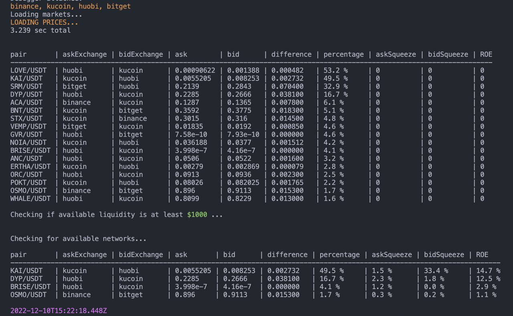

## CEX Crypto Arbitrage Script

Tech stack: JavaScript, Axios, Crypto, CCXT

JS-скрипт для поиска арбитражных возможностей на централизованных крипто-биржах.

Функционал:

- Мониторинг котировок на биржах
    - Binance
    - OKX
    - KuCoin
    - Huobi
    - Bitget
- Поиск расхождений в ценах (спредов)
- Учёт доступной ликвидности в ордер-буках
- Автоматический расчёт сквиза при заданном объёме ордера
- Проверка наличия совместимых сетей между биржами и возможности вывода
- **Вывод в консоль найденных цепочек с учётом всех перечисленных параметров**

---
## CEX Crypto Arbitrage Script

Tech stack: JavaScript, Axios, Crypto, CCXT

A JS script for identifying arbitrage opportunities on centralized crypto exchanges.

### Features:

- Monitoring quotes on exchanges:
  - Binance
  - OKX
  - KuCoin
  - Huobi
  - Bitget
- Detecting price discrepancies (spreads)
- Accounting for available liquidity in order books
- Automatic squeeze calculation for a given order volume
- Checking for compatible networks between exchanges and withdrawal availability
- **Displaying detected arbitrage chains in the console with all the specified parameters considered**
